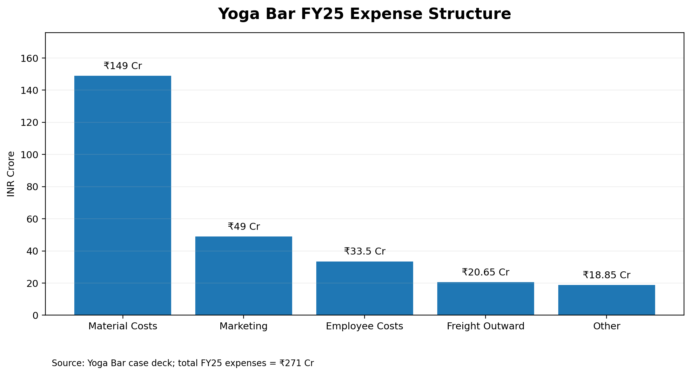
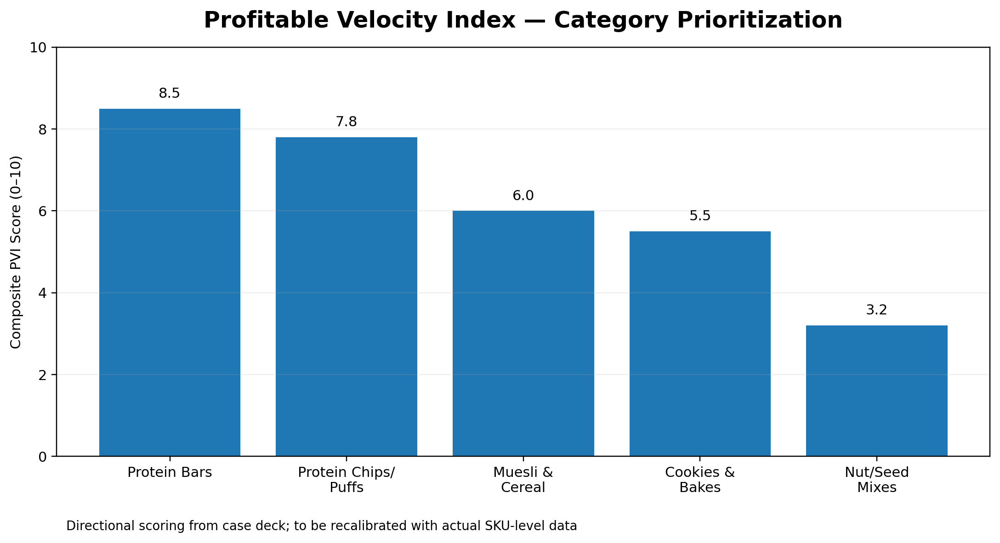
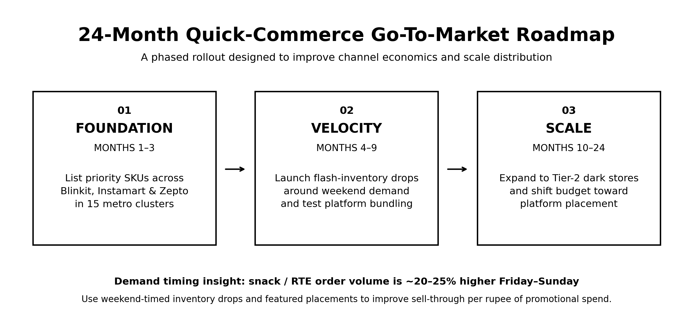

# Yoga Bar — Profitable Quick-Commerce Scale-Up Strategy

### Business Strategy Case Study | Growth Strategy • Unit Economics • GTM • Portfolio Optimization

> **Strategic question:** How can Yoga Bar accelerate growth without proportionally increasing customer acquisition costs?

---

## Executive Summary

Yoga Bar is growing revenue while facing increasing pressure on profitability. FY25 marketing spend increased **90% YoY**, while net loss widened **15% to INR 69.5 Cr**.

This case study evaluates **quick-commerce as a scalable growth channel** and develops a data-driven framework to prioritize the product portfolio for profitable expansion.

### Key Recommendation

Shift incremental growth investment toward a **quick-commerce-first Go-To-Market strategy**, supported by a **Profitable Velocity Index (PVI)** that prioritizes products based on:

- Contribution Margin
- Price-Band Fit
- Sell-Through Velocity

### Projected Impact

| Metric | Projection |
|---|---:|
| Blended CAC Reduction | **12–15%** |
| Incremental ARR by Year 2 | **$11M** |
| Phase 1 Coverage | **15 Metro Clusters** |
| FY25 Material Cost Share | **55%** |

> *CAC and ARR figures are analyst projections developed for this case study, not company-disclosed targets.*

---

## Business Problem

Yoga Bar's growth engine has become increasingly marketing-intensive.

### FY25 Snapshot

| Metric | FY25 |
|---|---:|
| Total Expenses | **INR 271 Cr** |
| Marketing Spend | **INR 49 Cr** |
| Net Loss | **INR 69.5 Cr** |
| Material Costs | **INR 149 Cr** |
| Material Cost Share | **55%** |

Marketing spend increased from **INR 25.9 Cr to INR 49 Cr**, while net loss increased from **INR 60.5 Cr to INR 69.5 Cr**.

The strategic challenge was to identify a growth channel and product mix capable of improving acquisition economics while supporting rapid expansion.

---

## Strategic Approach

### 01 — Diagnose

Analyzed Yoga Bar's FY25 **unit economics and cost structure** to identify the key drivers of profitability pressure.

### 02 — Prioritize

Developed the **Profitable Velocity Index (PVI)** to evaluate product categories across:

**Contribution Margin + Price-Band Fit + Sell-Through Velocity**

### 03 — Activate

Designed a phased **quick-commerce Go-To-Market strategy** across 15 metro clusters, followed by demand-timed inventory deployment and broader dark-store expansion.

### 04 — Measure

Defined **CAC reduction and incremental ARR** as key commercial outcome metrics.

---

## Cost Structure

Material costs represented **55% of FY25 expenses**, making margin improvement a central component of the strategy.

---

## Profitable Velocity Index

The PVI provides a structured framework for prioritizing products for quick-commerce distribution.

### Framework Components

**Contribution Margin**  
Evaluates the post-material-cost economics of the product.

**Price-Band Fit**  
Assesses suitability for the targeted quick-commerce price range.

**Sell-Through Velocity**  
Evaluates relative turnover potential and inventory efficiency.

The resulting framework enables **data-driven portfolio prioritization** rather than expanding the full SKU portfolio uniformly.

---

## Go-To-Market Strategy

### Phase 1 — Foundation | Months 1–3

List priority SKUs across **Blinkit, Instamart and Zepto** in 15 metro clusters.

### Phase 2 — Velocity | Months 4–9

Test **flash-inventory drops** around higher-demand weekend periods and experiment with platform bundling.

### Phase 3 — Scale | Months 10–24

Expand into **Tier-2 dark stores** and progressively shift growth investment toward platform placement.

---

## Projected Impact

The case projects:

### **12–15%**
Reduction in blended CAC

### **$11M**
Incremental ARR by Year 2

These figures represent **analyst projections based on the case methodology** and should be recalibrated using actual company-level operational data before implementation.

---

## Project Deliverables

### Presentation
[View the full Strategy Presentation](presentation/Yoga_Bar_Quick_Commerce_Strategy.pdf)

### Analysis
[PVI Framework & Analysis](analysis/PVI_Framework.xlsx)

### Visuals
- [FY25 Cost Structure](visuals/cost_structure.png)
- [PVI Framework](visuals/pvi_framework.png)
- [24-Month GTM Roadmap](visuals/gtm_roadmap.png)

---

## Skills Demonstrated

**Business Strategy**
- Growth Strategy
- Go-To-Market Strategy
- Channel Strategy
- Unit Economics
- Portfolio Prioritization

**Business Analytics**
- Cost Structure Analysis
- Contribution Margin Analysis
- KPI Frameworks
- Demand Analysis
- Scenario-Based Projections

**Commercial Strategy**
- Customer Acquisition Cost (CAC)
- Annual Recurring Revenue (ARR)
- Quick-Commerce
- Portfolio Optimization
- Market Expansion

---

## Methodology & Limitations

The case combines publicly reported company-level financial figures, industry-level quick-commerce information and third-party market estimates.

The **Profitable Velocity Index, SKU prioritization, GTM framework and financial-impact projections are original analysis** developed for this case study.

Actual SKU-level margin, customer acquisition and dark-store sell-through data were not publicly available. Therefore, the PVI and financial projections are **directional frameworks** intended to demonstrate the strategic approach and should be recalibrated using company-level data.

---

### Author

**Tanay Raj**  
IIT (ISM) Dhanbad | Business Strategy & Analytics
